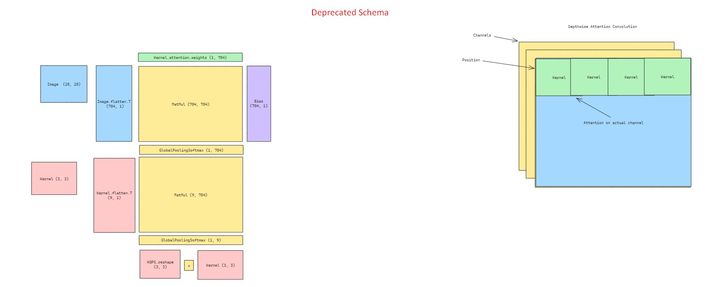

**Cladius: ML Solutions Library**

**Description:**

Welcome to the ML Solutions Library, an open-source repository dedicated to providing efficient, scalable, and easy-to-implement machine learning solutions. This project aims to bridge the gap between theoretical machine learning concepts and practical application needs.

Our library offers a comprehensive collection of modules, including various machine learning algorithms, pre-trained models, data preprocessing tools, and evaluation metrics. We focus on creating reusable components that can be easily integrated into your projects, saving time and effort in developing machine learning solutions from scratch.

Whether you're working on classification, regression, clustering, or neural network architectures, our library is designed to support your endeavors with modular, clear, and well-documented code. Dive into our collection of solutions, contribute your own, or join our community to discuss and evolve machine learning practices.

**Features:**
- Wide range of machine learning algorithms and models
- Modular design for easy integration and customization
- Preprocessing and data transformation tools
- Evaluation and performance metrics
- Community-driven enhancements and support

**Getting Started:**
To get started with the ML Solutions Library, please check out our [Installation Guide] and [User Manual]. For contributions, please refer to our [Contributing Guidelines].

**Support and Community:**
Join our community on [Community Platform] for discussions, support, and sharing ideas. Your contributions and feedback are welcome!

### 1. Depthwise Attention Convolution

#### 1.1 Paper
* Homemade

#### 1.2 Overview

